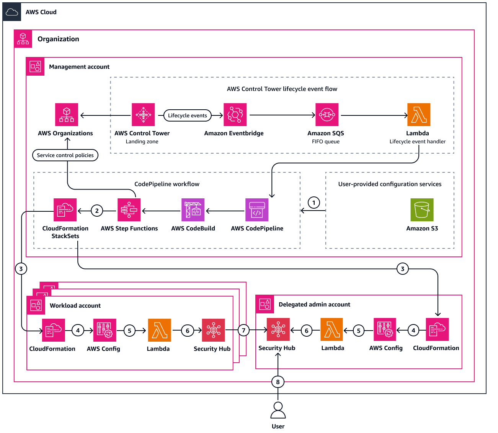

## Automatically audit AWS security groups that allow access from public IP addresses

As a security best practice, it is crucial to minimize the exposure of resources provisioned within AWS accounts to only what is absolutely necessary. One effective method for limiting resource access is by using Security Groups. However, evaluating Security Groups can become a cumbersome task, especially in multi-account setups. AWS Config rules and AWS Security Hub controls assist in identifying Security Groups that permit access from the entire internet (0.0.0.0/0) to specific services like SSH, HTTP, HTTPS, and RDP. However, these rules and controls are not applicable if services run on non-standard ports or if access is restricted to certain public IP addresses.

To address this, you can use the infrastructure as code (IaC) provided in this pattern to identify Security Groups that allow access from any non-private IP addresses to any service used by resources in your AWS account or AWS Organization. The AWS CloudFormation template provisions an AWS Config rule, an AWS Lambda function, and the necessary permissions. You can deploy it as a stack in a single account or as a stack set across the entire AWS organization.
The code in this repository helps you set up the following target architecture.

For prerequisites and instructions for using this AWS Prescriptive Guidance pattern, see [Automatically audit AWS security groups that allow access from public IP addresses](https://apg-library.amazonaws.com/content-viewer/author/caa8013b-3578-434b-b2c0-5ca7faf45d2d](https://docs.aws.amazon.com/prescriptive-guidance/latest/patterns/audit-security-groups-access-public-ip.html).

## Security

See [CONTRIBUTING](CONTRIBUTING.md#security-issue-notifications) for more information.

## License

This library is licensed under the MIT-0 License. See the LICENSE file.
